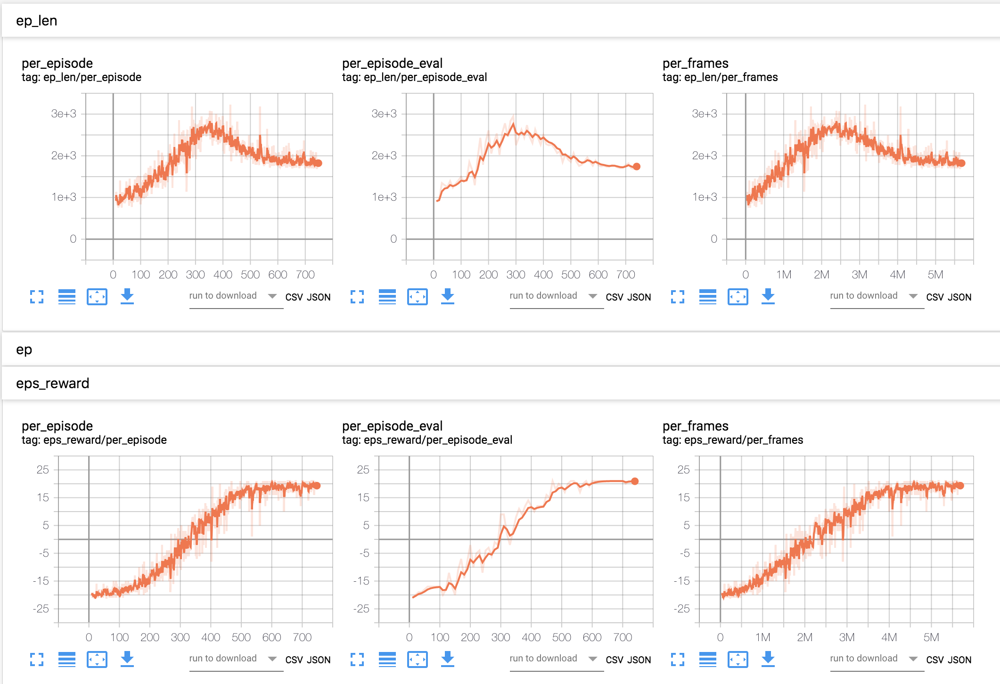
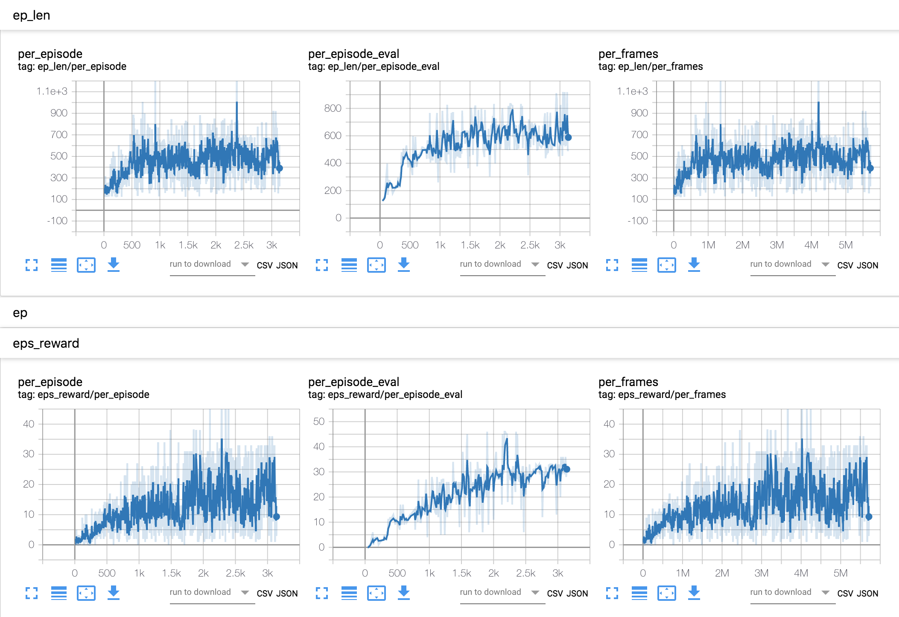

# Neural Episodic Control

Tensorflow implementation of [Neural Episodic Control (Pritzel et al.)](https://arxiv.org/abs/1703.01988).

:warning: This is not an official implementation, and might have some glitch (,or a major defect).

## Basic Setup

1. Please install basic Deep RL packages with your environment management system.

This code is tested under the environment having those packages:
```
python3.6+
tensorflow == 1.13.1
gym['atari'] == 0.12.0
numpy, opencv, etc.
```

2. Clone this repo

```
git clone git@github.com:hiwonjoon/NEC.git --recursive
```

3. Install `pyflann` approximated nearest neighbor algorithm.

```
cd libs/flann
mkdir build && cd build
cmake -DCMAKE_INSTALL_PREFIX=<path you want to install flann & pyflann library> ..
make -j8
make install
```

## Training

```
python q_learning.py --log_dir <path to logdir> --env_id <env id such as 'BreakoutNoFrameskip-v4'>
```

For more hyperparameters, please check out `q_learning.py`.

Note that the checkpoint file generated during training can be huge since the memory has to be preserved as a part of model.
In default, the checkpoint will be generated every 1 million timesteps.

## Evaluation

```
python q_learning.py --log_dir <path to logdir> --env_id <env id such as 'BreakoutNoFrameskip-v4'> --mode eval
```

You can specify specific model with the `--model_file` option; for example, policy after 5M timesteps can be loaded by providing `--model_file model.ckpt-5000000` option.

## Implementation Difference

The paper doesn't reveal few hyperparameters, such as epsilon decaying strategy or learning rate `alpha`. Such parameters are just picked using my hunch, and with the help of [the other NEC repo](https://github.com/mjacar/pytorch-nec). Along with unrevealed hyperparameters, I also used different hyperparameters: `delta` of `1e-5` instead of reported `1e-3` is used, the network and DND is update every `32` frames instead of `16`, and replay buffer size is set to `30000` instaed of `100000`.

One of the feature that is not implemented is replacing a memory when it find a exact match from a dictionary. However, I am unsure whether it will really happen since both embedding network and the saved embedding in the dictionary keep changing, so it is very unlikely to get a exact match even the exact same state is visited multiple times.

## Sample Result

- Pong

  - Trained policy after 5 million frames of training


  - Average Episode Reward: `21` (vs `about 15 @ 5 million frames`, `20.4 @ 10 million frames` from the original NEC paper)

  - Training Statistics



- Breakout

  - Trained policy after 5 million frames of training


  - Average Episode Reward: `27.5` (vs `13.6 @ 10 million frames` from the original NEC paper)

  - Training Statistics



## What is the big deal here?

IMHO, the coolest part of NEC is its straightforwardness; it does not requrie reward scaling scheme (most of the other RL altorithms clip reward -1 to 1 in order to stabilize value function learning), and it does not contain hyperparameters which does not physically grounded to something. It is basically cool continous extension of classical Tabular Q-learning.

Enjoy! :beer:

